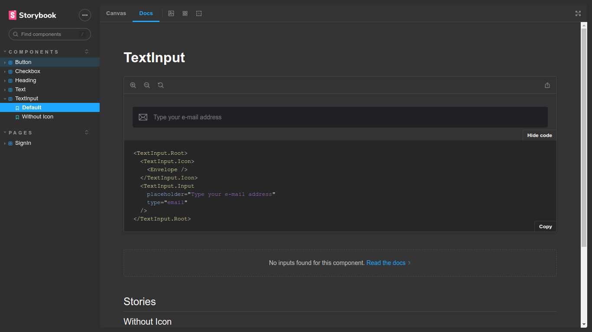

# 🚀 Ignite Lab DS


> Design System construído durante o Ignite Lab, evento gratuito da Rockeseat.

## 🖥️ Layout



## 🛠️ Techs

<div>
  
  
  
  
</div>

## 🛸 Instalação e Execução do projeto

Basta fazer um clone do repositório usando o git:

```bash
git clone https://github.com/LucasAndrade912/ignite-lab-ds.git
```

Depois de clonar o projeto instale suas dependências com o comando:

```bash
npm install

# or

yarn install
```

Para abrir formulário construido com os componentes do Design System use o comando: `npm run dev` ou `yarn dev`.

Para visualizar a documentação dos elementos do Design System rode: `npm run storybook` ou `yarn storybook`.
